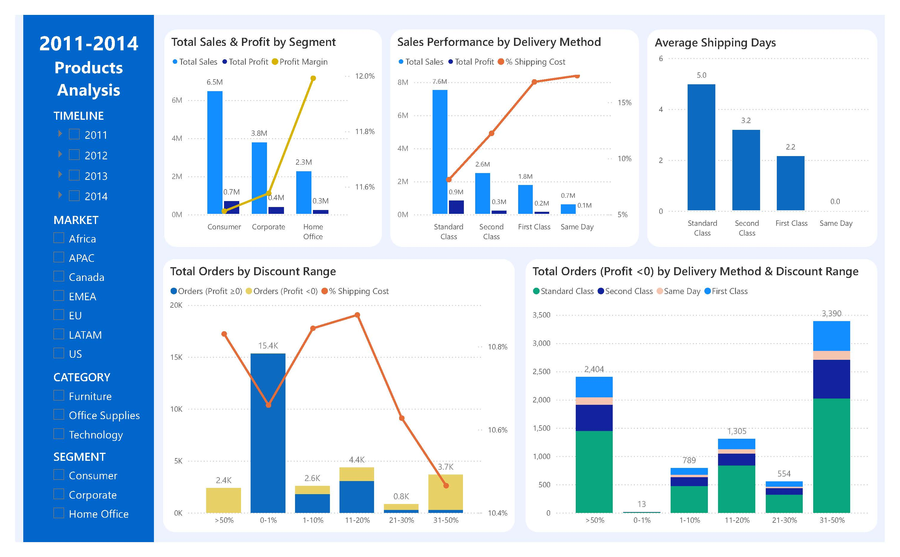

# Data Analytics Portfolio — Kim Thị Thanh Trang

## Project 1: Power BI Dashboard — Global Sales Performance Analysis

Analyzed 51,290 transaction records from SuperStore Orders (2011–2014, 7 global markets). Designed a star schema data model, built optimized DAX measures, and created a 4-page executive dashboard.

**Key metrics:** Revenue $12.64M | Profit $1.47M | Profit Margin 11.62%

**Key insight:** The Tables sub-category was the only one operating at a loss (-8.47% margin), driven by an excessively high average discount rate (29%) — suggesting the business should enforce category-level discount controls rather than a uniform policy.

📁 [Download .pbix file](01-powerbi-superstore/Dashboard.pbix) — open with free Power BI Desktop for full interactivity.

---

## Project 2: Python & Power BI – Assessing the operational health of TikiNow

Utilized Python (Pandas, Numby) on Google Colab, Power BI to analyze and visualize a 630K+ TikiNow order dataset, pinpointing last-mile bottlenecks (85% of lead-time) and system errors (8.4%) to propose an optimized SLA improvement plan.

📁 [View Report Tiki](02-python-pbi/tikinow_report.pdf)
📁 [View Colab Notebook](02-python-pbi/tikinow_eda.ipynb)

---

## Project 3: SQL Server — E-commerce Customer Segmentation & Behavior Analysis

Wrote advanced SQL queries using CTEs, JOIN and CASE WHEN statements to analyze e-commerce customer behavior and tag product segments by sales velocity.

📁 [View SQL queries](03-sql-ecommerce-customer.docx)

---
*This portfolio accompanies my CV for Data Analyst / Junior Data Analyst roles.*
