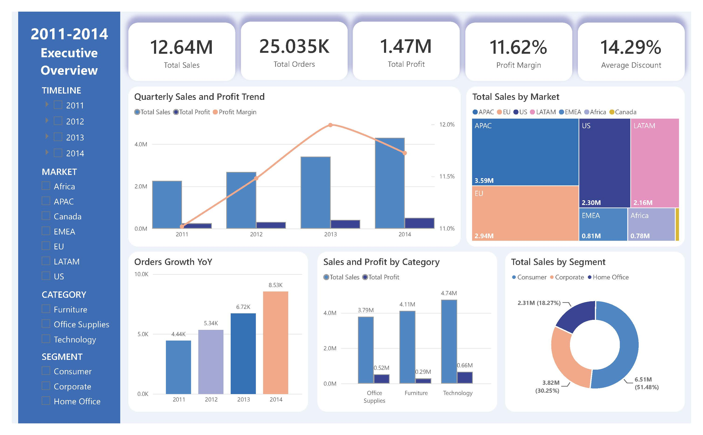
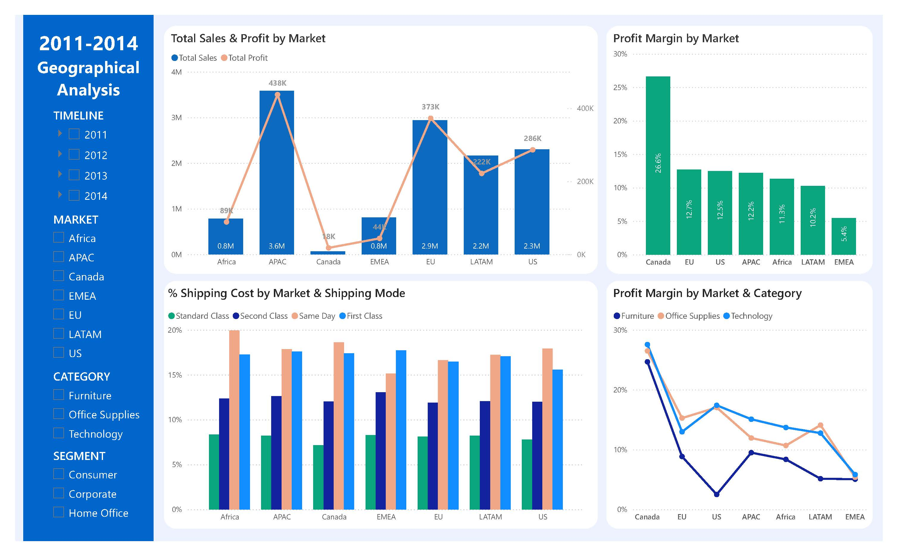
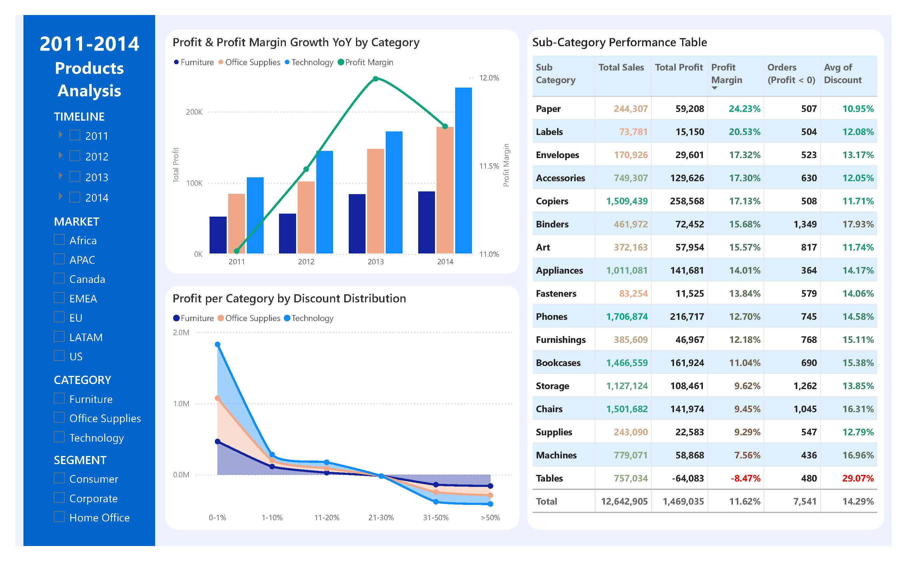

# Data Analytics Portfolio — Kim Thi Thanh Trang

13+ years of Accounting & Financial Analysis experience, transitioning into Data Analytics.
This repository showcases hands-on projects in Power BI, SQL, and Python completed during
the AI-Driven Data Analytics program at MindX Technology School.
---

## Project 1: Power BI Dashboard — Global Sales Performance Analysis

Analyzed 51,290 transaction records from SuperStore Orders (2011–2014, 7 global markets).
Designed a star schema data model, built optimized DAX measures, and created a 4-page
executive dashboard.

**Key metrics:** Revenue $12.64M | Profit $1.47M | Profit Margin 11.62%

**Key insight:** The Tables sub-category was the only one operating at a loss (-8.47% margin),
driven by an excessively high average discount rate (29%) — suggesting the business should
enforce category-level discount controls rather than a uniform policy.

📁 [Download .pbix file](Dashboard_SuperStore.pbix) — open with free Power BI Desktop for full interactivity.

---

## Project 2: SQL Server — E-commerce Customer Segmentation & Behavior Analysis

Wrote advanced SQL queries using CTEs, ROW_NUMBER(), and CASE WHEN statements to analyze
e-commerce customer behavior and tag product segments by sales velocity (Short/Mid/Long Tail).

📁 [View SQL queries](02-sql-ecommerce/customer-analysis-queries.sql)

---

## Project 3: Python — Bank Customer Churn Prediction

Built a Machine Learning classification model to predict bank customer churn based on
behavioral and transactional data. Performed feature engineering, model training, and
evaluation on Google Colab.

📁 [View Jupyter Notebook](03-python-churn-prediction_churn-prediction.ipynb)

---

*This portfolio accompanies my CV for Data Analyst / Junior Data Analyst roles.*
